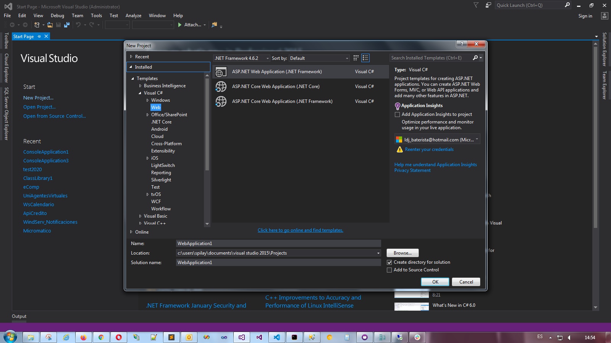
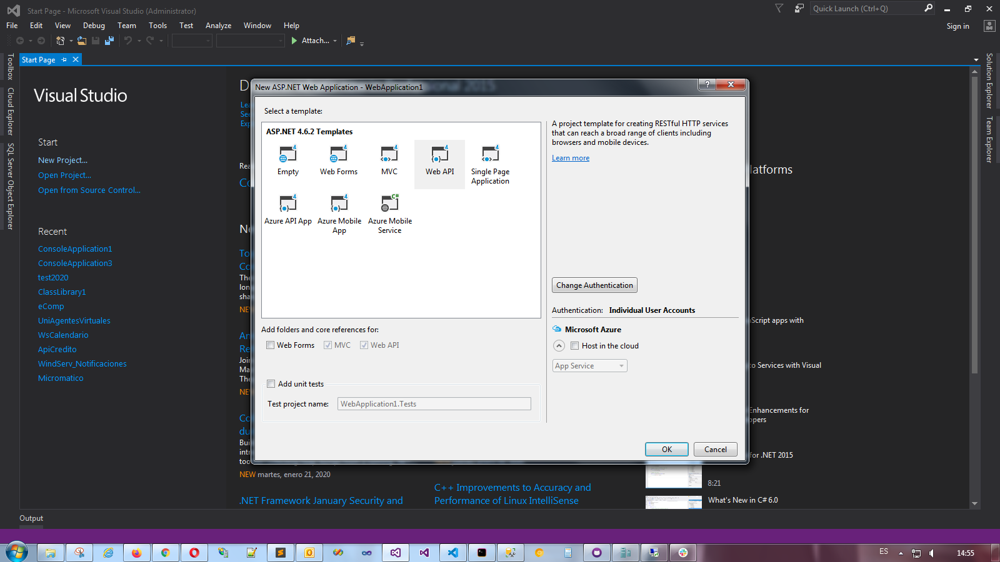
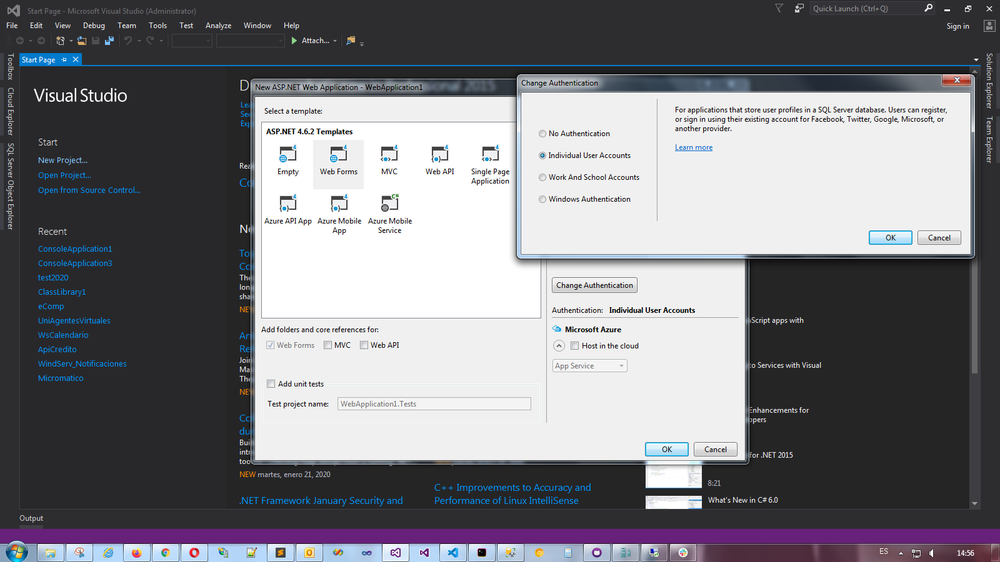
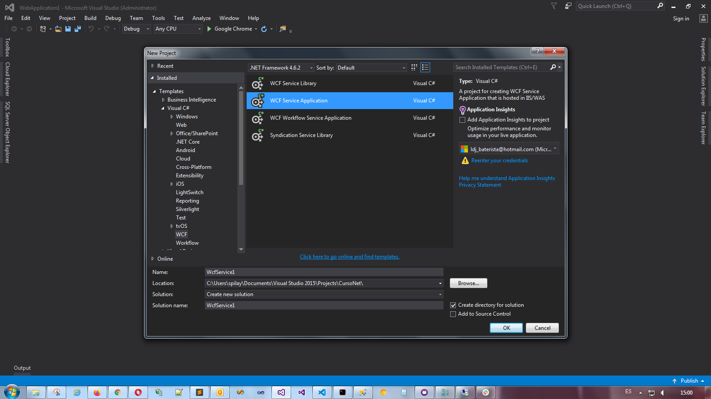
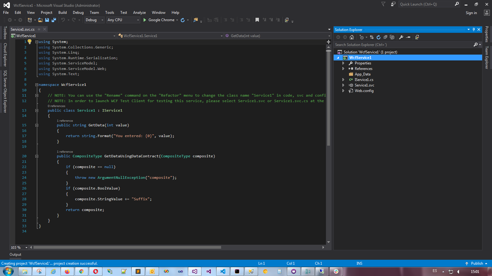
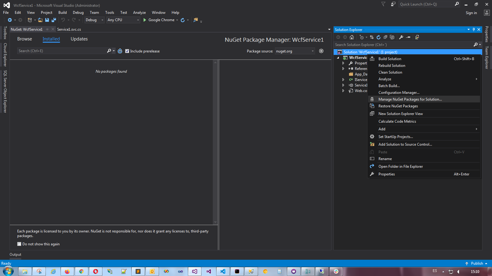

# Sesión 2

[início](/README.md)

### Crear aplicación Web con Visual Studio 2013 o posteriores








### WCF (Windows comunications fundations), fundamentos, ejemplos y ejercicios según los tipos de proyectos en De Prati con Visual Studio 2013 o posteriores






### Uso de la librería Newtonsoft para manejo de Json en C# y VB


* Conociendo [Newtonsoft](https://www.newtonsoft.com/)
* [Serializar Objetos](https://www.newtonsoft.com/json/help/html/SerializingJSON.htm) ejemplo: 
```csharp
var json = JsonConvert.SerializeObject(status)
```
* Como lo usamos
    * https://www.nuget.org/



